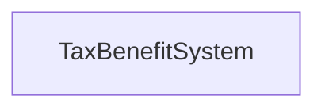
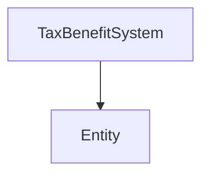

# Key concepts

## Tax and benefit system

The tax and benefit system is the higher-level object in OpenFisca.
Its goal is to model the legislation of a country.

OpenFisca is able to simulate any country legislation as long as it is (partially) represented as source code.

> The tax and benefit system is abbreviated as `TaxBenefitSystem`.

Basically a tax and benefit system contains simulation variables and legislation parameters.

## Parameters

## Variables

like [`irpp`](http://legislation.openfisca.fr/variables/irpp)

## Entities

