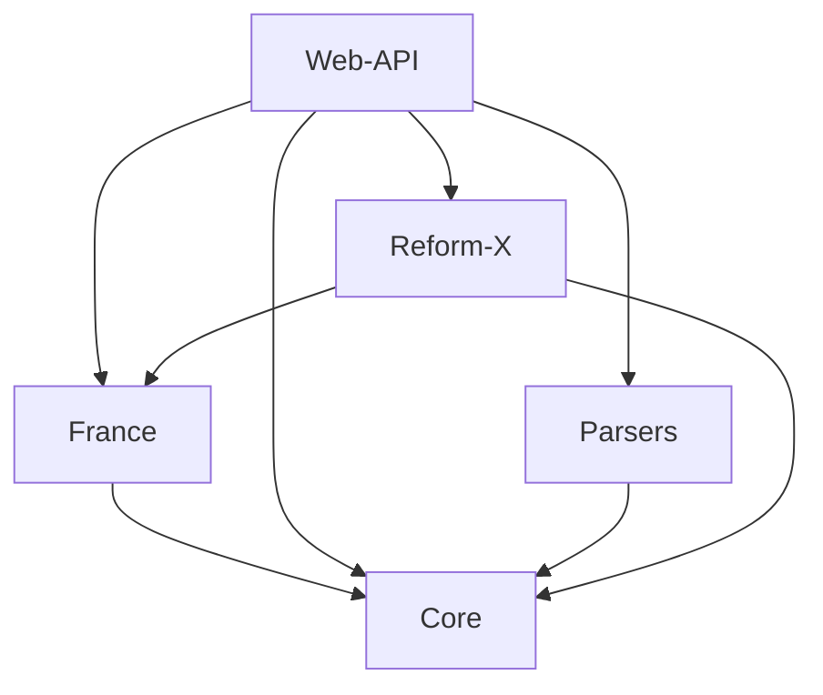
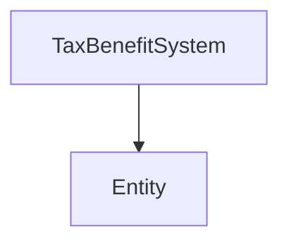

# Presentation

OpenFisca is an open microsimulation software of French tax-benefit system.
It allows users to simply calculate many social benefits and taxes paid by households and simulate the impact of reforms on their budget.
It is an educational tool intended to help citizens better understand the tax-benefit system.

The OpenFisca engine is completely independent of the tax-benefit system, it is therefore possible to simulate any country.

The impact of any modification in the legislation or formulas can also be computed via reforms.

When plugged on a survey, OpenFisca can also compute the budgetary consequences of a reform and its distributional impact.

For now the main supported country is France. The current version implements a large set of taxes, social benefits and housing provision for France for the last 10 years. Support for Tunisia is more experimental since the modelization of its tax-benefit system is less advanced (January 2015). But this is only due to a shortage in manpower to enter and update the Tunisian tax-benefit legislation.

## OpenFisca packages

## OpenFisca Core objects

