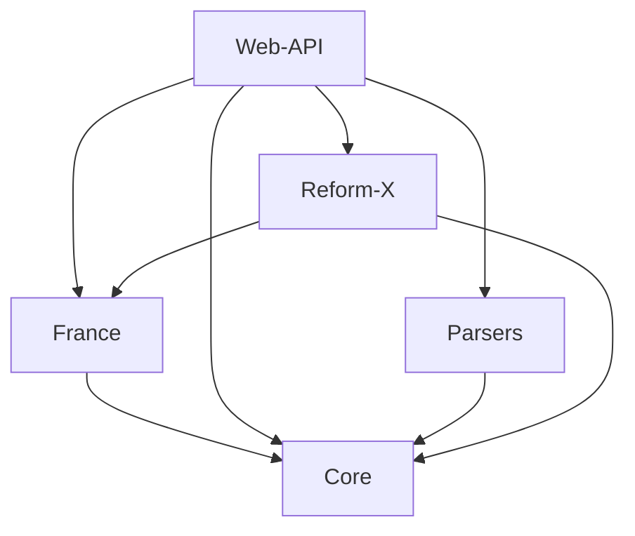
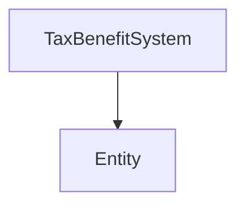

# Presentation

OpenFisca is an open microsimulation software of the French tax-benefit system.
It allows users to simply calculate many social benefits and taxes paid by households and simulate the impact of reforms on their budget.
It is an educational tool intended to help citizens better understand the tax-benefit system.

The OpenFisca engine is completely independent of the tax-benefit system, it is therefore possible to simulate any country.

The impact of any modification in the legislation or formulas can also be computed via reforms.

When plugged on a survey, OpenFisca can also compute the budgetary consequences of a reform and its distributional impact.

For now the main supported country is France. The current version implements a large set of taxes, social benefits and housing provision for France for the last 10 years. Support for Tunisia is more experimental since the modelization of its tax-benefit system is less advanced (January 2015). But this is only due to a shortage in manpower to enter and update the Tunisian tax-benefit legislation.

## FR

<h2>Qu'est-ce qu'OpenFisca</h2>

    OpenFisca est un moteur ouvert de microsimulation du système socio-fiscal français.
    Il permet de calculer simplement un grand nombre de prestations sociales et d'impôts payés
    par les ménages, et de simuler l'impact de réformes sur leur budget.
    Il s'agit d'un outil à vocation pédagogique pour aider les citoyens à mieux comprendre le système
    socio-fiscal.

    Le moteur d'OpenFisca étant totalement indépendant du système socio-fiscal, il est possible de simuler
    n'importe quel pays.

    L'impact des modifications de la législation ou des formules peut également être calculé via des réformes.
    <a href="${urls.get_url(ctx, 'reforms')}">Examples de réformes</a>

    Lorsqu'il est connecté sur des données d'enquête, OpenFisca peut aussi calculer les conséquences sur le
    budget d'une réforme et son impact sur la distribution.

    Pour le moment le principal pays supporté est la
    <a href="https://github.com/openfisca/openfisca-france" rel="external" target="_blank">France</a>.
    La version actuelle implémente un grand nombre d'impôts, de prestations sociales et d'aides au logement
    en France pour les 10 dernières années.
    La <a href="https://github.com/openfisca/openfisca-tunisia" rel="external" target="_blank">Tunisie</a>
    bénéficie d'une support plus expérimental car la modélisation de son système socio-fiscal est moins
    avancée (janvier 2015).
    Mais ceci est dû uniquement à un manque de main d'œuvre pour saisir et maintenir à jour la législation
    socio-fiscale tunisienne.

    <h4>Avertissement</h4>
    

        OpenFisca calcule les montants des cotisations sociales, des contributions sociales, des impôts
        et des prestations en utilisant :
    

    <ul>
        <li>les caractéristiques du ménage, telles que fournies par l'utilisateur</li>
        <li>un modèle <em>simplifié</em> et <em>approximatif</em> de la législation socio-fiscale</li>
    </ul>
    

        Ces montants sont seulement donnés à titre indicatif et peuvent être différents de ceux déterminés
        par les différentes administrations lors de l'étude des dossiers réels.
        Les résultats ne sauraient engager l'administration, ou plus généralement n'importe quel organisme
        impliqué dans le calcul des impôts et des prestations.
    

    

        En effet, votre situation familiale et/ou vos ressources ou celles de l'un des membres de votre
        famille peuvent changer ou ne pas avoir été prises en compte lors de la simulation et
        certaines hypothèses simplificatrices ont été effectuées.
    

<h2>Premiers pas</h2>

    L'<a href="${conf['urls.ui']}">interface utilisateur web</a> permet à l'utilisateur de calculer et
    d'afficher de façon interactive tous ces impôts et prestations pour n'importe quel type de foyer,
    et de jouer avec les réformes.

<h2>Historique d'OpenFisca</h2>

    Le développement d'OpenFisca a débuté en mai 2011 au
    <a href="http://www.strategie.gouv.fr/" rel="external" target="_blank">
      <abbr title="Centre d'analyse stratégique">CAS</abbr>
      (rebaptisé France Stratégie /
      <abbr title="Commissariat général à la stratégie et à la prospective">CGSP</abbr>
      en avril 2013)
    </a>
    avec le soutien de
    <a href="http://www.idep-fr.org/" rel="external" target="_blank">
        l'<abbr title="Institut d'économie publique">IDEP</abbr>
    </a>.
    Le code source a été diffusé sous une licence libre en novembre 2011.
    Initialement OpenFisca a été développé sous forme d'application de bureau
    (utilisant la librairie <a href="http://qt-project.org/" rel="external" target="_blank">Qt</a>)
    avec une API Python.

    Début 2014, quand <a href="https://www.etalab.gouv.fr/" rel="external" target="_blank">Etalab</a>
    s'est investi dans le développement d'OpenFisca, il a été décidé de :

<ul>
    <li>
        séparer le moteur du simulateur de son interface utilisateur d'application de bureau
    </li>
    <li>
        proposer une <a href="${urls.get_url(ctx, 'documentation', 'api')}">API web</a> en plus de l'API Python
        et de privilégier cette API web
    </li>
    <li>
        démontrer l'intérêt de l'API web en développant des exemples d'utilisation et notamment une
        interface web de simulation de cas personnels
    </li>
    <li>
        proposer un <em>accès public à cette API web</em>, ouvert à tous : administrations,
        chercheurs, citoyens, etc.
    </li>
</ul>

    Depuis cette date, le logiciel est développé intensivement par
    <a href="https://www.etalab.gouv.fr/" rel="external" target="_blank">Etalab</a>.
    Parallèlement le
    <a href="http://www.strategie.gouv.fr/" rel="external" target="_blank">
        <abbr title="Commissariat général à la stratégie et à la prospective">CGSP</abbr>
    </a>,
    appuyé par
    <a href="http://www.idep-fr.org/" rel="external" target="_blank">
        l'<abbr title="Institut d'économie publique">IDEP</abbr>
    </a>
    et
    <a href="http://www.ipp.eu/" rel="external" target="_blank">
        l'<abbr title="Institut des politiques publiques">IPP</abbr>
    </a>, améliore le modèle économique et actualise la législation socio-fiscale française.

    Actuellement (mars 2014), la version Qt n'est plus maintenue et seule la version web fait l'objet de
    développements.

## EN

<h2>What is OpenFisca?</h2>

    OpenFisca is an open microsimulation software of French tax-benefit system. It allows users to simply
    calculate many social benefits and taxes paid by households and simulate
    the impact of reforms on their budget.
    It is an educational tool intended to help citizens better understand the tax-benefit system.

    The OpenFisca engine is completely independent of the tax-benefit system,
    it is therefore possible to simulate any country.

    The impact of any modification in the legislation or formulas can also be computed via reforms.
    <a href="${urls.get_url(ctx, 'reforms')}">Example reforms</a>

    When plugged on a survey, OpenFisca can also compute the budgetary consequences
    of a reform and its distributional impact.

    For now the main supported country is
    <a href="https://github.com/openfisca/openfisca-france" rel="external" target="_blank">France</a>.
    The current version implements a large set of taxes, social benefits
    and housing provision for France for the last 10 years.
    Support for
    <a href="https://github.com/openfisca/openfisca-tunisia" rel="external" target="_blank">Tunisia</a>
    is more experimental since the modelization of its tax-benefit system is less advanced (January 2015).
    But this is only due to a shortage in manpower to enter and update the Tunisian tax-benefit legislation.

    <h4>Disclaimer</h4>
    
OpenFisca calculates the amounts of payroll taxes, taxes, and benefits using:

    <ul>
        <li>the household's characteristics, as indicated by the user</li>
        <li>a <em>simplified</em> and <em>approximate</em> model of the tax-benefit legislation</li>
    </ul>
    

        These amounts are given only as indicators and may differ from those determined by various authorities
        for your real situation. The results cannot be held against the administration,
        or more generally, against any organization involved in the calculation of taxes and benefits.
    

    

        In fact, your family situation and/or resources or those of a member of your family may change or
        may not have been taken into account in the simulation. Some simplifying hypotheses may have been made.
    

<h2>Getting started</h2>

    The <a href="${conf['urls.ui']}">web user interface</a> allows the user to compute and display interactively
    all these taxes and benefits for any type of household, and play with reforms.

<h2>History of OpenFisca</h2>

    The development of OpenFisca began in May 2011 at the
    <a href="http://www.strategie.gouv.fr/" rel="external" target="_blank">
        <abbr title="Centre d'analyse stratégique">CAS</abbr>
        (renamed France Stratégie /
        <abbr title="Commissariat général à la stratégie et à la prospective">CGSP</abbr>
        in April 2013)
    </a>
    with the support of the
    <a href="http://www.idep-fr.org/" rel="external" target="_blank">
        l'<abbr title="Institut d'économie publique">IDEP</abbr>
    </a>.
    The source code has been released under a free license in November 2011.
    OpenFisca was originally developed as a desktop application
    (using <a href="http://qt-project.org/" rel="external" target="_blank">Qt</a> library)
    with a Python API.

    In the early 2014, when <a href="https://www.etalab.gouv.fr/" rel="external" target="_blank">Etalab</a>
    started being implicated in the development of OpenFisca, it was decided to:

<ul>
    <li>
        separate the simulator's engine from its desktop user interface
    </li>
    <li>
        offer a <a href="${urls.get_url(ctx, 'documentation', 'api')}">web API</a>
        in addition to the Python API and favor the first it over the latter
    </li>
    <li>
        demonstrate the value of the web API by developing sample applications including
        a web interface to simulate personal cases
    </li>
    <li>
       propose a <em>public access to this web API</em>,
       open to all: administrations, researchers, citizens, etc.
    </li>
</ul>

    Since then, the software is being developed extensively by
    <a href="https://www.etalab.gouv.fr/" rel="external" target="_blank">Etalab</a>.
    Meanwhile the economic model is being improved and the tax-benefit legislation updated by the
    <a href="http://www.strategie.gouv.fr/" rel="external" target="_blank">
        <abbr title="Commissariat général à la stratégie et à la prospective">CGSP</abbr>
    </a>,
    with the help of the
    <a href="http://www.idep-fr.org/" rel="external" target="_blank">
        <abbr title="Institut d'économie publique">IDEP</abbr>
    </a>
    and the
    <a href="http://www.ipp.eu/" rel="external" target="_blank">
        <abbr title="Institut des politiques publiques">IPP</abbr>
    </a>.

    As of now (March 2014), the Qt version is no longer maintained and only the web version is being developped.

## OpenFisca packages

## OpenFisca Core objects

